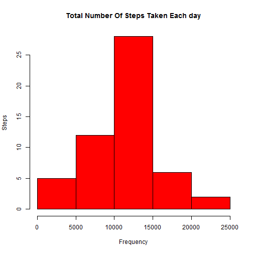
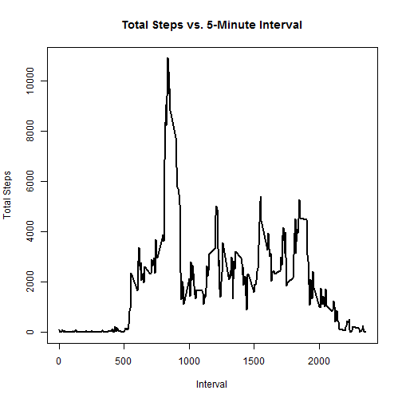
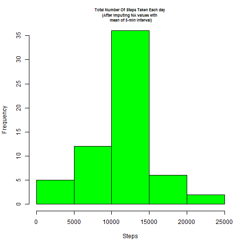
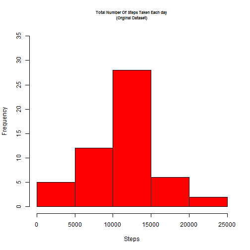
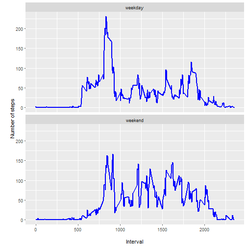

## R Markdown

This is an R Markdown document. Markdown is a simple formatting syntax for authoring HTML, PDF, and MS Word documents. For more details on using R Markdown see <http://rmarkdown.rstudio.com>.

When you click the **Knit** button a document will be generated that includes both content as well as the output of any embedded R code chunks within the document. You can embed an R code chunk like this:


```r
summary(cars)
```

```
##      speed           dist       
##  Min.   : 4.0   Min.   :  2.00  
##  1st Qu.:12.0   1st Qu.: 26.00  
##  Median :15.0   Median : 36.00  
##  Mean   :15.4   Mean   : 42.98  
##  3rd Qu.:19.0   3rd Qu.: 56.00  
##  Max.   :25.0   Max.   :120.00
```

## Including Plots

You can also embed plots, for example:


```r
plot(pressure)
```


```r
library(ggplot2)
library(dplyr)
library(chron)
```
## 1. Load the data


```r
a <- read.csv("activity.csv", header = TRUE)
head(a)
```

```
##   steps       date interval
## 1    NA 2012-10-01        0
## 2    NA 2012-10-01        5
## 3    NA 2012-10-01       10
## 4    NA 2012-10-01       15
## 5    NA 2012-10-01       20
## 6    NA 2012-10-01       25
```
## Histogram of the total number of steps taken each day

```r
aggsteps<- aggregate(steps ~ date, a, FUN=sum)
head(aggsteps)
```

```
##         date steps
## 1 2012-10-02   126
## 2 2012-10-03 11352
## 3 2012-10-04 12116
## 4 2012-10-05 13294
## 5 2012-10-06 15420
## 6 2012-10-07 11015
```

#Ploting histogram using hist() from Base Plotting

```r
hist(aggsteps$steps, 
     col="red", 
     xlab = "Frequency", 
     ylab = "Steps",
     main = "Total Number Of Steps Taken Each day")
```


#Calculate and report the mean and median total number of steps taken per day

```r
amean <- mean(aggsteps$steps)
amedian <- median(aggsteps$steps)
```
##Mean total number of steps taken per day

```r
amean
```

```
## [1] 10766.19
```
#Median total number of steps taken per day

```r
amedian
```

```
## [1] 10765
```
#Make a time series plot (i.e. type = "l") of the 5-minute interval (x-axis) and the average number of steps taken, averaged across all days (y-axis)

```r
agginterval <- aggregate(steps ~ interval, a, FUN=sum)
```
#Plotting line graph using plot() from Base Plotting for Total Steps vs 5-Minute Interval

```r
plot(agginterval$interval, agginterval$steps, 
     type = "l", lwd = 2,
     xlab = "Interval", 
     ylab = "Total Steps",
     main = "Total Steps vs. 5-Minute Interval")
```


#The 5-minute interval that, on average, contains the maximum number of steps

```r
filter(agginterval, steps==max(steps))
```

```
##   interval steps
## 1      835 10927
```
#Code to describe and show a strategy for imputing missing data

```r
table(is.na(a))
```

```
## 
## FALSE  TRUE 
## 50400  2304
```
#Devise a strategy for filling in all of the missing values in the dataset. The strategy does not need to be sophisticated. For example, you could use the mean/median for that day, or the mean for that 5-minute interval, etc.
#In the original data set aggregating (mean) steps over 5-minute interval

```r
meaninterval<- aggregate(steps ~ interval, a, FUN=mean)
```
#Merging the mean of total steps for a date with the original data set

```r
anew <- merge(x=a, y=meaninterval, by="interval")
head(anew)
```

```
##   interval steps.x       date  steps.y
## 1        0      NA 2012-10-01 1.716981
## 2        0       0 2012-11-23 1.716981
## 3        0       0 2012-10-28 1.716981
## 4        0       0 2012-11-06 1.716981
## 5        0       0 2012-11-24 1.716981
## 6        0       0 2012-11-15 1.716981
```
##Replacing the NA values with the mean for that 5-minute interval

```r
anew$steps <- ifelse(is.na(anew$steps.x), anew$steps.y, anew$steps.x)
```
#Merged dataset which will be subsetted in the next step by removing not required columns

```r
head(anew)
```

```
##   interval steps.x       date  steps.y    steps
## 1        0      NA 2012-10-01 1.716981 1.716981
## 2        0       0 2012-11-23 1.716981 0.000000
## 3        0       0 2012-10-28 1.716981 0.000000
## 4        0       0 2012-11-06 1.716981 0.000000
## 5        0       0 2012-11-24 1.716981 0.000000
## 6        0       0 2012-11-15 1.716981 0.000000
```
#Create a new dataset that is equal to the original dataset but with the missing data filled in.

```r
anew <- select(anew, steps, date, interval)
head(anew)
```

```
##      steps       date interval
## 1 1.716981 2012-10-01        0
## 2 0.000000 2012-11-23        0
## 3 0.000000 2012-10-28        0
## 4 0.000000 2012-11-06        0
## 5 0.000000 2012-11-24        0
## 6 0.000000 2012-11-15        0
```
#Histogram of the total number of steps taken each day after missing values are imputed
#Aggregating(summation) of steps over date

```r
aggsteps_new<- aggregate(steps ~ date, anew, FUN=sum)
```
#Plotting
#Setting up the pannel for one row and two columns

```r
par(mfrow=c(1,2))
```
#Histogram after imputing NA values with mean of 5-min interval

```r
hist(aggsteps_new$steps, 
     col="green",
     xlab = "Steps", 
     ylab = "Frequency",
     ylim = c(0,35),
     main = "Total Number Of Steps Taken Each day \n(After imputing NA values with \n mean of 5-min interval)",
     cex.main = 0.7)
```



#Histogram with the orginal dataset

```r
hist(aggsteps$steps, 
     col="red", 
     xlab = "Steps", 
     ylab = "Frequency",
     ylim = c(0,35),
     main = "Total Number Of Steps Taken Each day \n(Orginal Dataset)",
     cex.main = 0.7)
```



```r
par(mfrow=c(1,1)) #Resetting the panel

amean_new <- mean(aggsteps_new$steps)
amedian_new <- median(aggsteps_new$steps)
```
#Comparing Means

```r
paste("New Mean      :", round(amean_new,2), "," ,  
      " Original Mean :", round(amean,2),"," , 
      " Difference :",round(amean_new,2) -  round(amean,2))
```

```
## [1] "New Mean      : 10766.19 ,  Original Mean : 10766.19 ,  Difference : 0"
```
#Comparing Medians

```r
paste("New Median    :", amedian_new, ",", 
      " Original Median :", amedian,"," , 
      " Difference :",round(amedian_new-amedian,2))
```

```
## [1] "New Median    : 10766.1886792453 ,  Original Median : 10765 ,  Difference : 1.19"
```
#Panel plot comparing the average number of steps taken per 5-minute interval across weekdays and weekends

```r
anew$dayofweek <- ifelse(is.weekend(anew$date), "weekend", "weekday")

table(anew$dayofweek)
```

```
## 
## weekday weekend 
##   12960    4608
```

```r
head(anew)
```

```
##      steps       date interval dayofweek
## 1 1.716981 2012-10-01        0   weekday
## 2 0.000000 2012-11-23        0   weekday
## 3 0.000000 2012-10-28        0   weekend
## 4 0.000000 2012-11-06        0   weekday
## 5 0.000000 2012-11-24        0   weekend
## 6 0.000000 2012-11-15        0   weekday
```


#Aggregating(mean) steps over interval and day of week

```r
meaninterval_new<- aggregate(steps ~ interval + dayofweek, anew, FUN=mean)
```
#Aggregated Data

```r
head(meaninterval_new)
```

```
##   interval dayofweek      steps
## 1        0   weekday 2.25115304
## 2        5   weekday 0.44528302
## 3       10   weekday 0.17316562
## 4       15   weekday 0.19790356
## 5       20   weekday 0.09895178
## 6       25   weekday 1.59035639
```
#Time Series plot using ggplot

```r
ggplot(meaninterval_new, aes(x=interval, y=steps)) + 
  geom_line(color="blue", size=1) + 
  facet_wrap(~dayofweek, nrow=2) +
  labs(x="\nInterval", y="\nNumber of steps")
```


#DONE


